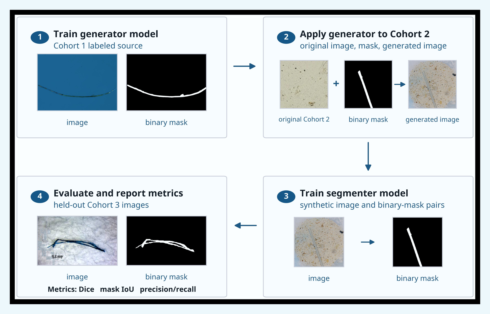
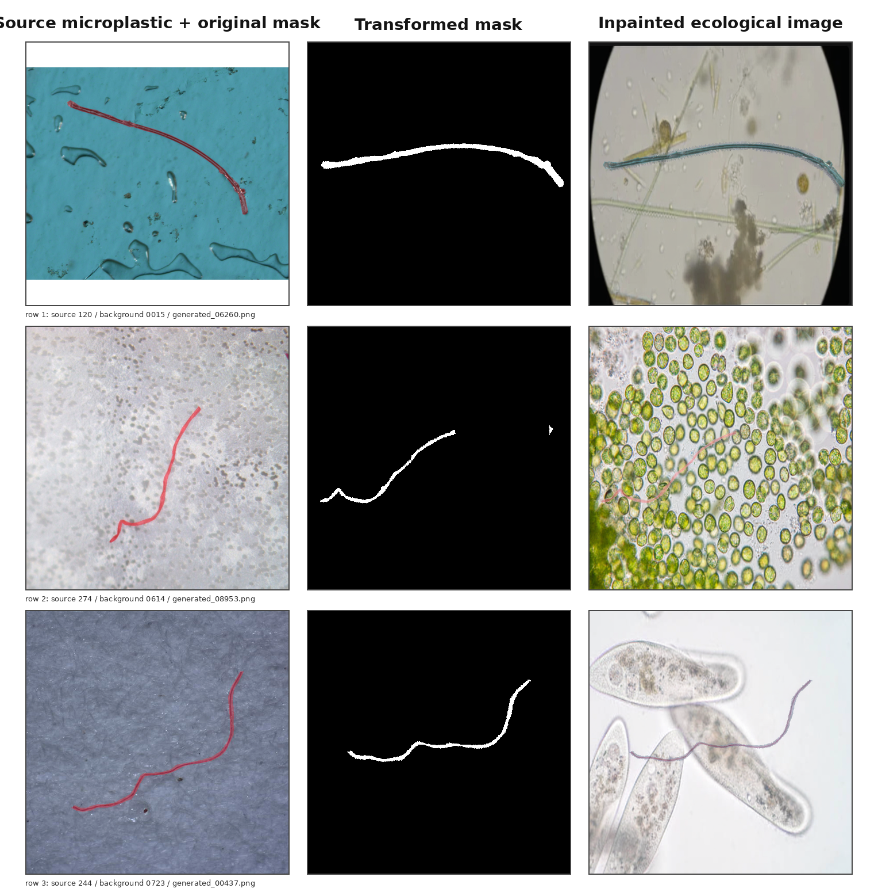

# Synthetic Microplastic Detection

This repository contains tools and experiment code for microplastic image
metadata exploration, synthetic data generation, and segmentation benchmarking.

The repository is source-focused. Large local datasets, generated image batches,
training runs, model checkpoints, and compiled artifacts are intentionally
excluded from git.

## Figures

### Workflow Complex Variation



### 3x3 Image-Varied Inference Grid



## Repository Layout

- `scripts/`: dataset download, metadata filtering, visualization, and figure helpers.
- `docs/`: dataset notes and generated documentation assets.
- `codex/microplastic_benchmark/`: reusable benchmark package for data loading,
  generation, model construction, training, metrics, and evaluation.
- `codex/configs/`: benchmark experiment matrices and model settings.
- `codex/scripts/`: benchmark orchestration, training, evaluation, and reporting scripts.
- `code/`: earlier stable diffusion, GAN, preprocessing, and segmentation scripts.
- `tests/`: smoke tests for the Stable Diffusion training pipeline.
- `images/` and `overleaf_microplastic_project/`: paper figures and manuscript source.
- `model_settings_full.txt`: consolidated Stable Diffusion and segmentation model settings.

## Install

Basic metadata tooling:

```bash
python -m pip install -r requirements.txt
```

Benchmark package:

```bash
python -m pip install -r codex/requirements.txt
python -m pip install -e codex
```

GPU training workflows require CUDA-compatible PyTorch plus the model/data
assets referenced by the configs.

## Dataset Utilities

Download metadata only:

```bash
python scripts/download_image_explorer.py \
  --output-dir data/microplastic_image_explorer
```

Download metadata plus images:

```bash
python scripts/download_image_explorer.py \
  --output-dir data/microplastic_image_explorer \
  --download-images \
  --workers 24
```

Visualize size-labeled morphology records:

```bash
python scripts/visualize_metadata.py \
  --metadata data/microplastic_image_explorer/metadata/image_metadata.csv \
  --images-dir data/microplastic_image_explorer/images \
  --output-dir docs/assets
```

## Benchmark Workflow

From `codex/`:

```bash
python scripts/validate_data.py --config configs/benchmark.yaml
python scripts/prepare_manifests.py --config configs/benchmark.yaml
python scripts/plan_runs.py --config configs/benchmark.yaml --available-only
python scripts/smoke_test.py --config configs/benchmark.yaml
```

Train a semantic segmentation run:

```bash
python scripts/train_segmenter.py \
  --config configs/benchmark.yaml \
  --run-id baseline_c1__monai_unet__seed13
```

Train a YOLO segmentation run:

```bash
python scripts/train_yolo_segmenter.py \
  --config configs/benchmark.yaml \
  --run-id baseline_c1__yolo11m_seg__seed13 \
  --weights yolo11m-seg.pt
```

Evaluate completed PyTorch semantic checkpoints:

```bash
python scripts/evaluate_registry.py --config configs/benchmark.yaml
python scripts/aggregate_results.py
```

## Data And Artifact Policy

The following are ignored because they are large or machine-specific:

- `data/`, `codex/data/`
- `generated/`
- `codex/results/`, `codex/runs/`
- checkpoints and weights such as `*.pt`, `*.pth`, `*.ckpt`, `*.safetensors`
- split datasets, generated samples, logs, caches, Office exports, and compiled PDFs

Use the scripts and configs in this repo to recreate datasets, runs, and figures
in a local workspace.
