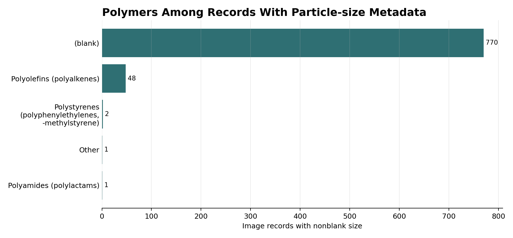
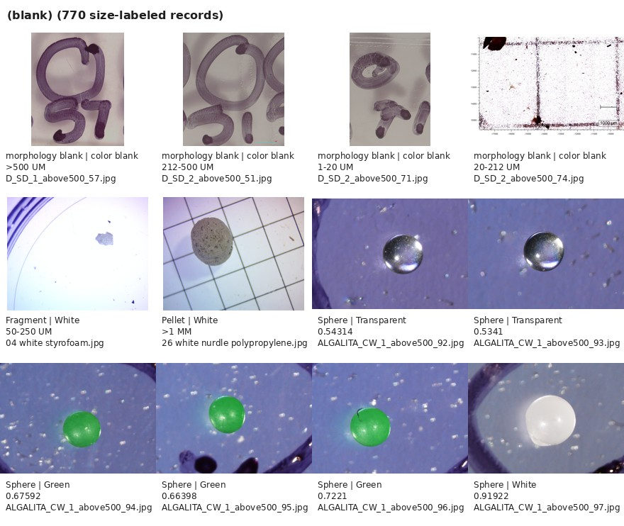
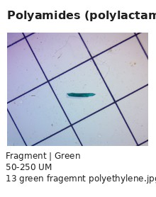
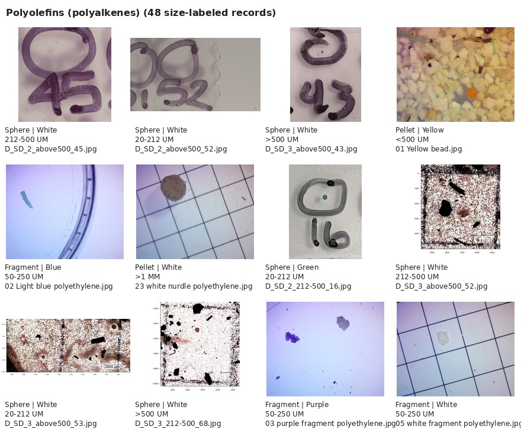
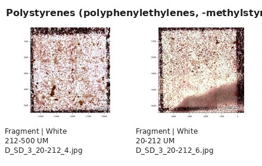
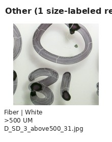

# Microplastic Image Explorer Dataset Tools

Code for downloading the OpenAnalysis / Moore Institute Microplastic Image
Explorer dataset, filtering its metadata, and visualizing records that include
particle-size metadata.

Dataset source: <https://www.openanalysis.org/microplastic_image_explorer/>

The full image dataset is about 2.53 GB and is downloaded into `data/`, which is
ignored by git.

## Install

```bash
python -m pip install -r requirements.txt
```

## Download

Metadata only:

```bash
python scripts/download_image_explorer.py \
  --output-dir data/microplastic_image_explorer
```

Metadata plus all 10,182 images:

```bash
python scripts/download_image_explorer.py \
  --output-dir data/microplastic_image_explorer \
  --download-images \
  --workers 24
```

## Visualize Particle-size Metadata

```bash
python scripts/visualize_metadata.py \
  --metadata data/microplastic_image_explorer/metadata/image_metadata.csv \
  --images-dir data/microplastic_image_explorer/images \
  --output-dir docs/assets
```

This creates:

- particle-size metadata availability
- polymer counts among records with particle-size metadata
- one montage for each nonblank polymer among records with particle-size metadata

## 1. Particle-size Metadata Availability


## 2. Polymers Among Records With Particle-size Metadata



Most records with particle-size metadata have a blank polymer field, so the
blank class is shown as its own montage.

## 3. Polymer Montages for Size-labeled Records

### Blank Polymer



### Polyamides



### Polyolefins



### Polystyrenes



### Other



## Filter Metadata

Example: filter records with particle-size metadata and a nonblank polymer:

```bash
python scripts/filter_metadata.py \
  --metadata data/microplastic_image_explorer/metadata/image_metadata.csv \
  --has-size \
  --polymer poly \
  --output outputs/size_labeled_polymer_records.csv \
  --write-urls outputs/size_labeled_polymer_urls.txt
```

## Scale Note

The `size` field is particle-size metadata, not image pixel calibration. It is
sparse and mixed-format. Do not assume the dataset provides microns-per-pixel
scale for every image.

Read [docs/microplastic_image_explorer_metadata.md](docs/microplastic_image_explorer_metadata.md)
for details on particle-size metadata, magnification fields in supporting
tables, and safe wording for papers.
