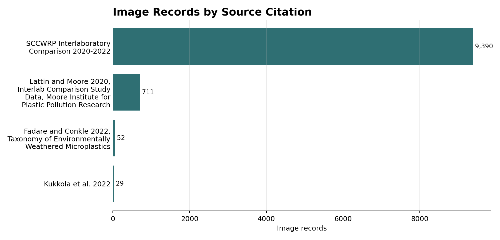
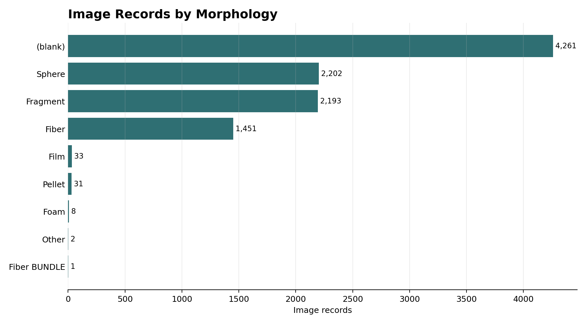
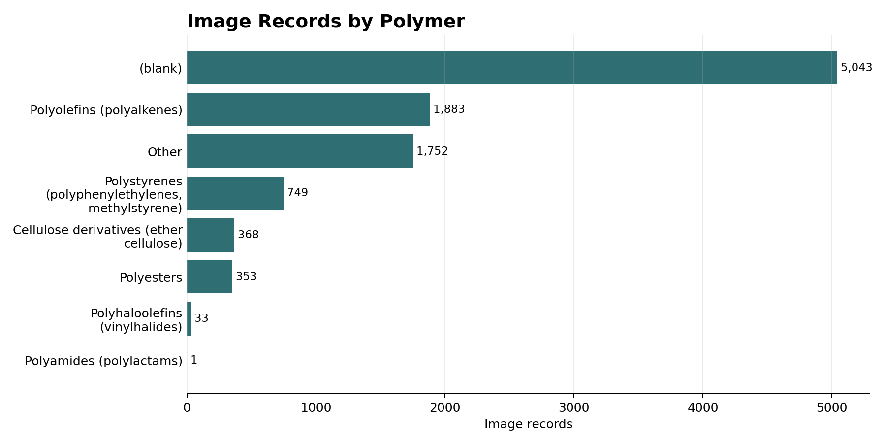
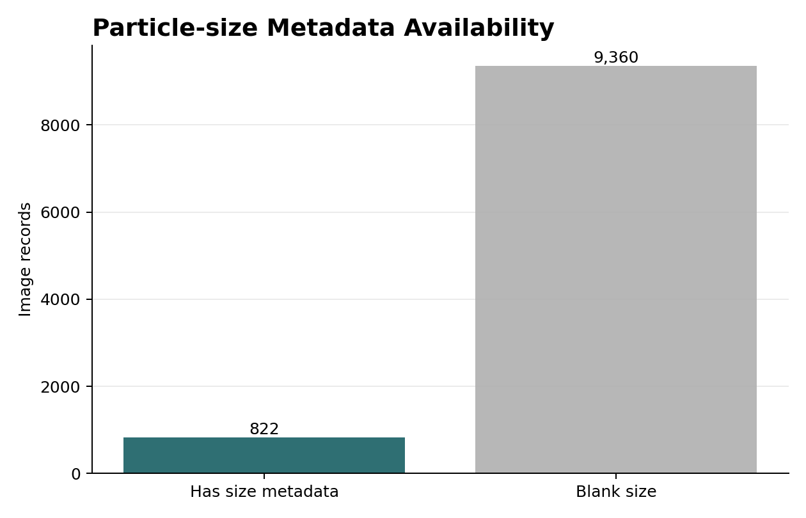
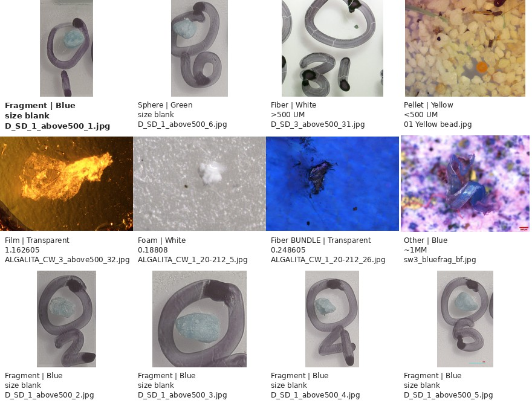

# Microplastic Image Explorer Dataset Tools

Code for downloading the OpenAnalysis / Moore Institute Microplastic Image
Explorer dataset, filtering its metadata, and visualizing the metadata.

Dataset source: <https://www.openanalysis.org/microplastic_image_explorer/>

This repository does not store the full downloaded dataset. The image files are
about 2.53 GB and are written under `data/`, which is ignored by git.

## Install

```bash
python -m pip install -r requirements.txt
```

The downloader and filter scripts use the Python standard library. The
visualization script uses `matplotlib` and `pillow`.

## Download the Dataset

Download metadata only:

```bash
python scripts/download_image_explorer.py \
  --output-dir data/microplastic_image_explorer
```

Download metadata and all 10,182 images:

```bash
python scripts/download_image_explorer.py \
  --output-dir data/microplastic_image_explorer \
  --download-images \
  --workers 24
```

The downloader writes:

```text
data/microplastic_image_explorer/
├── metadata/
│   ├── app.json
│   ├── image_metadata.csv
│   └── app_bundle/
├── images/
└── manifests/
    ├── dataset_summary.json
    ├── image_manifest.csv
    └── metadata_manifest.csv
```

Current app metadata contains:

- 10,182 image records
- 10,182 unique file names
- 822 records with nonblank particle-size metadata
- full image download size: 2,534,004,672 bytes, about 2.53 GB / 2.36 GiB

## Filter Metadata

Filter for fiber records with a nonblank `size` field:

```bash
python scripts/filter_metadata.py \
  --metadata data/microplastic_image_explorer/metadata/image_metadata.csv \
  --morphology fiber \
  --has-size \
  --output outputs/fibers_with_size.csv \
  --write-urls outputs/fibers_with_size_urls.txt
```

Filter by source/citation:

```bash
python scripts/filter_metadata.py \
  --metadata data/microplastic_image_explorer/metadata/image_metadata.csv \
  --citation "Fadare and Conkle" \
  --output outputs/fadare_conkle.csv \
  --write-urls outputs/fadare_conkle_urls.txt
```

Download only a filtered subset:

```bash
python scripts/filter_metadata.py \
  --metadata data/microplastic_image_explorer/metadata/image_metadata.csv \
  --morphology fragment \
  --color blue \
  --output outputs/blue_fragments.csv \
  --download-images \
  --images-dir data/blue_fragments/images \
  --manifest outputs/blue_fragments_manifest.csv
```

## Visualize Metadata

After downloading metadata, generate plots:

```bash
python scripts/visualize_metadata.py \
  --metadata data/microplastic_image_explorer/metadata/image_metadata.csv \
  --images-dir data/microplastic_image_explorer/images \
  --output-dir docs/assets
```

If images have not been downloaded, the metadata plots are still created and
only the example-image sheet is skipped.

## Example Outputs

### Dataset Sources



### Morphology Distribution



### Polymer Distribution



### Particle-size Metadata Availability



### Example Images



## Metadata and Scale

The primary metadata table has these columns:

- `citation`
- `color`
- `morphology`
- `polymer`
- `size`
- `type`
- `researcher`
- `file_names`

The `size` field is particle-size metadata, not image pixel calibration. It is
sparse and mixed-format. Do not assume the dataset provides microns-per-pixel
scale for every image.

Read [docs/microplastic_image_explorer_metadata.md](docs/microplastic_image_explorer_metadata.md)
for details on particle-size metadata, magnification fields in supporting
tables, and safe wording for papers.
